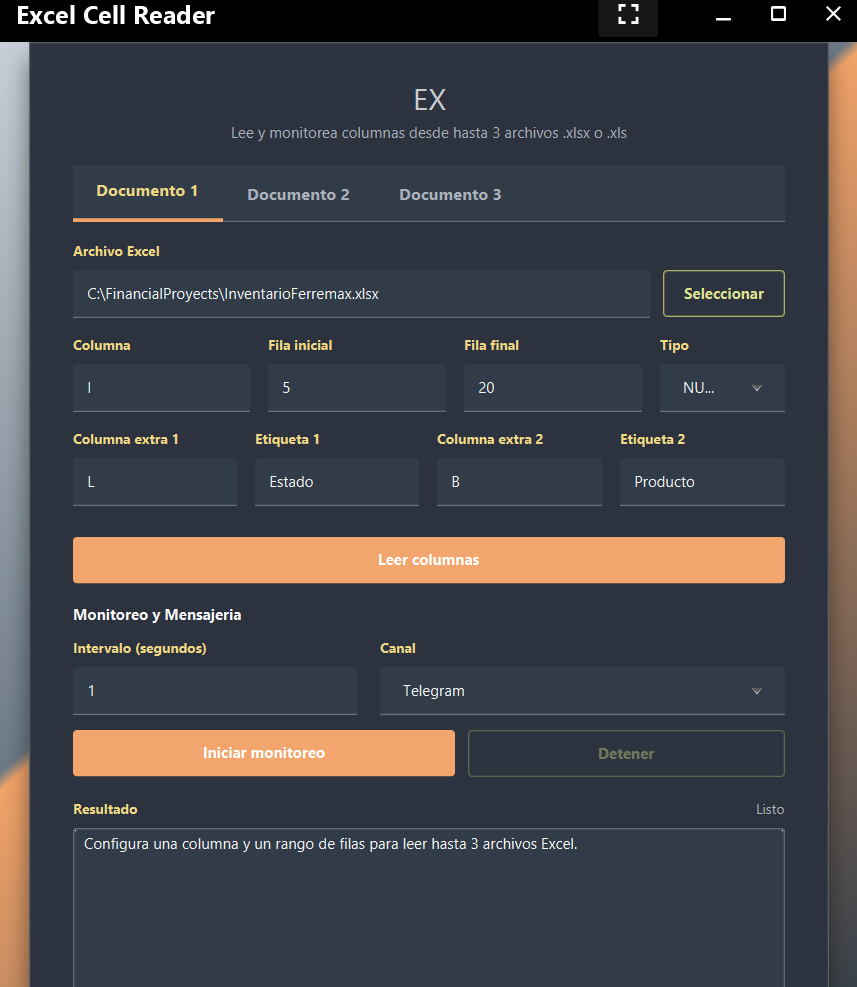

# Excel Cell Reader

Aplicacion de escritorio en JavaFX para leer y monitorear columnas de archivos Excel. Permite configurar hasta 3 documentos al mismo tiempo, revisar una columna principal por rango de filas, anexar hasta 2 columnas extra de contexto por fila y enviar alertas por Telegram o WhatsApp cuando cambien valores.



## Que hace

- Lee archivos `.xlsx` y `.xls`.
- Muestra 3 pestanas, una por documento.
- Permite seleccionar o escribir manualmente la ruta del archivo.
- Lee una columna principal dentro de un rango de filas.
- Permite agregar 2 columnas extra por documento para contexto, por ejemplo `Estado` y `Ubicacion`.
- Valida el tipo esperado de la columna principal: texto, numero, fecha o booleano.
- Lee las columnas extra como texto visible de Excel para evitar errores por formato mixto.
- Monitorea los documentos en intervalos configurables.
- Toma la primera lectura como base y compara lecturas posteriores.
- Envia alerta solo cuando cambia la columna principal.
- En cada alerta incluye el archivo origen, las celdas que cambiaron y los valores extra de la misma fila.
- Permite cambiar el canal de mensajeria entre Telegram y WhatsApp.
- Carga configuracion desde `application.properties`, variables de entorno, `.env` y un archivo local opcional.

## Tecnologias

- Java 17
- JavaFX 21
- Apache POI
- Log4j2
- dotenv-java
- Maven

## Estructura clave

```text
src/main/java/com/example/excelreader
  AppConfig.java
  CellDataType.java
  MainApp.java
  MainController.java

src/main/java/com/example/excelreader/models
  CellChange.java
  DocumentMonitorConfig.java
  ExtraColumnValues.java
  MonitorConfig.java
  RowSnapshot.java

src/main/java/com/example/excelreader/service
  AppConfigService.java
  CellMonitorService.java
  ExcelReader.java
  ExcelReaderService.java
  MessageChannel.java
  NotificationService.java
  NotificationServiceRegistry.java
  TelegramNotificationService.java
  WhatsAppNotificationService.java

src/main/resources
  application.properties
  css/styles.css
  fxml/main-view.fxml
```

## Interfaz

La pantalla principal tiene:

- Un `TabPane` moderno con 3 pestanas: `Documento 1`, `Documento 2`, `Documento 3`.
- Ruta de archivo editable y boton para seleccionar archivo.
- Columna principal.
- Fila inicial y fila final.
- Tipo de dato esperado para la columna principal.
- Dos pares de campos para columnas extra:
    - `Columna extra 1` + `Etiqueta 1`
    - `Columna extra 2` + `Etiqueta 2`
- Boton `Leer columnas`.
- Selector de canal: `TELEGRAM` o `WHATSAPP`.
- Botones para iniciar y detener monitoreo.

## Configuracion

La configuracion base vive en:

```text
src/main/resources/application.properties
```

La app resuelve placeholders como `${FILE_PATH_1}` desde este orden:

1. Propiedades del sistema de Java, por ejemplo `-DVARIABLE=valor`
2. Variables de entorno del sistema
3. Archivo `.env` en la raiz del proyecto

Tambien existe un archivo local opcional:

```text
config/application-local.properties
```

Si existe, sobreescribe valores de `application.properties`. Puedes partir de:

```text
config/application-local.example.properties
```

## Variables por documento

Cada documento usa estas variables:

```env
FILE_PATH_1=C:\FinancialProyects\InventarioFerremax.xlsx
COLUMN_1=I
START_ROW_1=5
END_ROW_1=15
DATA_TYPE_1=NUMERO
EXTRA_COLUMN_1_A=J
EXTRA_LABEL_1_A=Estado
EXTRA_COLUMN_1_B=K
EXTRA_LABEL_1_B=Ubicacion

FILE_PATH_2=
COLUMN_2=
START_ROW_2=1
END_ROW_2=1
DATA_TYPE_2=NUMERO
EXTRA_COLUMN_2_A=
EXTRA_LABEL_2_A=Estado
EXTRA_COLUMN_2_B=
EXTRA_LABEL_2_B=Ubicacion

FILE_PATH_3=
COLUMN_3=
START_ROW_3=1
END_ROW_3=1
DATA_TYPE_3=NUMERO
EXTRA_COLUMN_3_A=
EXTRA_LABEL_3_A=Estado
EXTRA_COLUMN_3_B=
EXTRA_LABEL_3_B=Ubicacion
```

Notas:

- Los documentos 2 y 3 pueden quedarse vacios si no se usan.
- Las columnas extra son opcionales.
- Las etiquetas extra controlan el nombre que saldra en la alerta.
- Para el documento 1 todavia hay compatibilidad con variables anteriores: `FILE_PATH`, `CELL_REFERENCE` y `excel.cell.data-type`.

## Mensajeria

Las credenciales son compartidas por todos los documentos:

```env
TOKEN_TELEGRAM=tu_token_de_telegram
CHAT_ID_TELEGRAM=tu_chat_id

WHATSAPP_TOKEN=tu_access_token_de_whatsapp
WHATSAPP_PHONE_ID=tu_phone_number_id
WHATSAPP_PHONE_NUMBER_TO=524426520700
```

En `application.properties` se configura el canal inicial:

```properties
messaging.channel=TELEGRAM
```

Valores disponibles:

```text
TELEGRAM
WHATSAPP
```

La interfaz tambien permite cambiar el canal antes de iniciar el monitoreo.

## WhatsApp

WhatsApp usa Graph API:

```properties
whatsapp.graph-api-version=v25.0
```

El numero destino debe ir en formato internacional. Para Mexico normalmente empieza con `52`; en algunos casos de WhatsApp puede requerir `521`.

## Como funcionan las alertas

Al iniciar el monitoreo:

1. La app lee la columna principal de cada documento configurado.
2. Guarda esa lectura como base.
3. En cada barrido posterior vuelve a leer los mismos rangos.
4. Compara solo la columna principal.
5. Si la columna principal no cambio, no envia alerta.
6. Si cambio una o varias celdas, envia solo esas celdas.
7. Para cada celda cambiada agrega los valores de las columnas extra en la misma fila.

Ejemplo de alerta:

```text
Archivo: InventarioFerremax.xlsx
Columna I actualizada. Cambios detectados: 1.

I12: 300 -> 275
Estado: Reordenar
Ubicacion: A-01
```

## Leer columnas sin monitorear

El boton `Leer columnas` sirve para validar la configuracion antes de iniciar el monitoreo. Muestra:

- Archivo leido.
- Columna principal y rango.
- Valores de la columna principal.
- Valores de columnas extra, si fueron configuradas.

## Ejecutar

Desde la carpeta `excel-cell-reader`:

```bash
mvn javafx:run
```

Para solo compilar:

```bash
mvn -DskipTests compile
```

## Flujo de uso

1. Configura `.env`, variables de entorno o `config/application-local.properties`.
2. Ejecuta la app.
3. En cada pestana que uses, selecciona o escribe la ruta del archivo Excel.
4. Escribe la columna principal, por ejemplo `A`, `D`, `I` o `AA`.
5. Define fila inicial y fila final.
6. Elige el tipo de dato esperado.
7. Agrega hasta 2 columnas extra si necesitas contexto.
8. Presiona `Leer columnas` para validar.
9. Elige `TELEGRAM` o `WHATSAPP`.
10. Presiona `Iniciar monitoreo`.

## Notas

- No subas tokens reales al repositorio.
- Si usas `.env`, ejecuta la app desde la carpeta `excel-cell-reader`.
- Las mismas credenciales de Telegram y WhatsApp sirven para los 3 documentos.
- La primera lectura no dispara alerta; solo prepara la base de comparacion.
- El estilo del `TabPane` esta personalizado en `src/main/resources/css/styles.css` para mantener la paleta oscura, ambar y oliva de la app.
