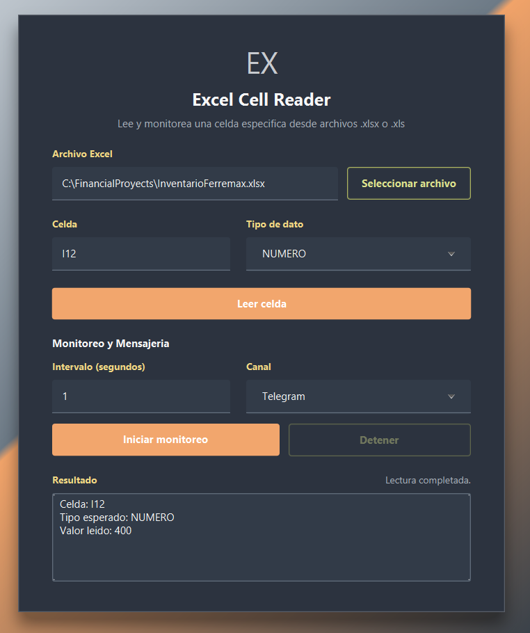

# Excel Cell Reader

Aplicacion de escritorio en JavaFX para leer y monitorear una celda especifica de un archivo Excel. Esta pensada para casos donde necesitas vigilar un valor de negocio, inventario, finanzas o cualquier hoja `.xlsx` / `.xls`, y recibir una alerta por `Telegram` o `WhatsApp` cuando ese valor cambia.



## Que hace

- Permite seleccionar un archivo Excel desde la interfaz.
- Lee una celda concreta, por ejemplo `A1`, `D5` o `I12`.
- Valida el tipo esperado de dato: texto, numero, fecha o booleano.
- Monitorea la celda en intervalos configurables.
- Detecta cambios comparando el valor anterior contra el nuevo.
- Envia una notificacion cuando la celda cambia.
- Soporta Telegram y WhatsApp con un strategy pattern para cambiar de canal sin tocar el monitor.
- Carga configuracion desde `application.properties`, variables de entorno y `.env`.

## Tecnologias

- Java 17
- JavaFX 21
- Apache POI para leer Excel
- Log4j2 para logs
- dotenv-java para cargar `.env`
- Maven

## Estructura importante

```text
src/main/java/com/example/excelreader
  MainApp.java
  MainController.java
  AppConfig.java

src/main/java/com/example/excelreader/service
  AppConfigService.java
  CellMonitorService.java
  ExcelReaderService.java
  NotificationService.java
  NotificationServiceRegistry.java
  TelegramNotificationService.java
  WhatsAppNotificationService.java
  MessageChannel.java

src/main/resources
  application.properties
  fxml/main-view.fxml
  css/styles.css
```

## Configuracion

La configuracion principal vive en:

```text
src/main/resources/application.properties
```

Ese archivo usa placeholders como:

```properties
excel.file.path=${FILE_PATH}
telegram.bot.token=${TOKEN_TELEGRAM}
whatsapp.access-token=${WHATSAPP_TOKEN}
```

La app resuelve esos valores desde:

1. Propiedades del sistema de Java (`-DVARIABLE=valor`)
2. Variables de entorno del sistema
3. Archivo `.env` en la raiz del proyecto

## Archivo .env

Crea un archivo `.env` en la carpeta del proyecto `excel-cell-reader`:

```env
FILE_PATH=C:\FinancialProyects\InventarioFerremax.xlsx
CELL_REFERENCE=I12

TOKEN_TELEGRAM=tu_token_de_telegram
CHAT_ID_TELEGRAM=tu_chat_id

WHATSAPP_TOKEN=tu_access_token_de_whatsapp
WHATSAPP_PHONE_ID=tu_phone_number_id
WHATSAPP_PHONE_NUMBER_TO=524426520700
```

Para WhatsApp, el numero destino debe ir en formato internacional. Para Mexico normalmente empieza con `52`; en algunos casos de WhatsApp puede requerir `521` antes del numero.

## Elegir canal de mensajeria

En `application.properties` puedes definir el canal inicial:

```properties
messaging.channel=TELEGRAM
```

Valores disponibles:

```text
TELEGRAM
WHATSAPP
```

Tambien puedes cambiarlo desde la interfaz usando el selector de canal en la seccion de monitoreo.

## Telegram

La estrategia de Telegram envia mensajes usando:

```text
https://api.telegram.org/bot{TOKEN}/sendMessage
```

Necesitas:

- `TOKEN_TELEGRAM`: token del bot.
- `CHAT_ID_TELEGRAM`: chat id destino.

## WhatsApp

La estrategia de WhatsApp envia mensajes con WhatsApp Cloud API:

```text
https://graph.facebook.com/{version}/{phone-number-id}/messages
```

El payload enviado es de tipo texto:

```json
{
  "messaging_product": "whatsapp",
  "to": "524426520700",
  "type": "text",
  "text": {
    "body": "Mensaje de alerta"
  }
}
```

Necesitas:

- `WHATSAPP_TOKEN`: access token de Meta.
- `WHATSAPP_PHONE_ID`: phone number id configurado en Meta.
- `WHATSAPP_PHONE_NUMBER_TO`: numero destino.
- `whatsapp.graph-api-version`: version de Graph API, por ejemplo `v25.0`.

## Ejecutar

Desde la carpeta `excel-cell-reader`:

```bash
mvn javafx:run
```

Para solo compilar:

```bash
mvn -DskipTests compile
```

## Flujo de uso

1. Configura tu `.env`.
2. Ejecuta la app.
3. Selecciona el archivo Excel.
4. Escribe la celda a leer.
5. Elige el tipo de dato esperado.
6. Presiona `Leer celda` para probar.
7. Elige el canal de mensajeria.
8. Define el intervalo en segundos.
9. Presiona `Iniciar monitoreo`.

Cuando el valor cambie, la app enviara una alerta por el canal seleccionado.

## Notas

- No subas tokens reales al repositorio.
- Si usas `.env`, ejecuta la app desde la carpeta `excel-cell-reader` para que `dotenv-java` lo encuentre.
- Si existe `config/application-local.properties`, sus valores sobreescriben los de `application.properties`.
- El monitor solo envia mensajes cuando detecta un cambio; la primera lectura se usa como valor inicial.
